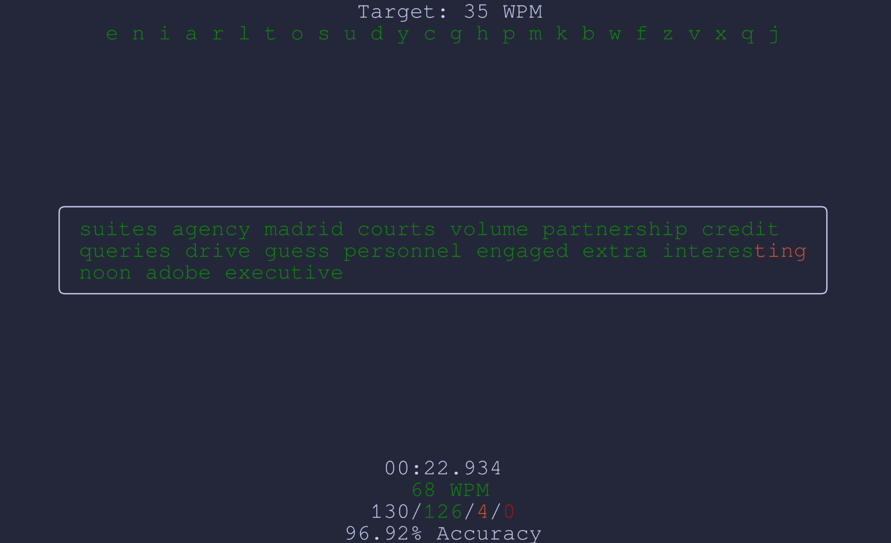

# Keys

A simple program for practicing typing, largely inspired by [keybr](https://www.keybr.com/).

## Instructions
```bash
git clone 
cd keys
go mod tidy
go run ./cmd/tui/
```
### Requirements
[Golang](https://go.dev/doc/install)

## Usage
- Just start typing!
- Press +/- to increase/decrease the number of "unlocked" letters
## Features
- [x] Variable number of unlocked letters
- [x] Visual feedback for mistakes
- [x] Timing information
- [x] Accuracy metrics
- [ ] Stat tracking over time
- [ ] Unlocking new letters after reaching WPM goals
- [ ] Per key accuracy
- [ ] Targeting specific letters
